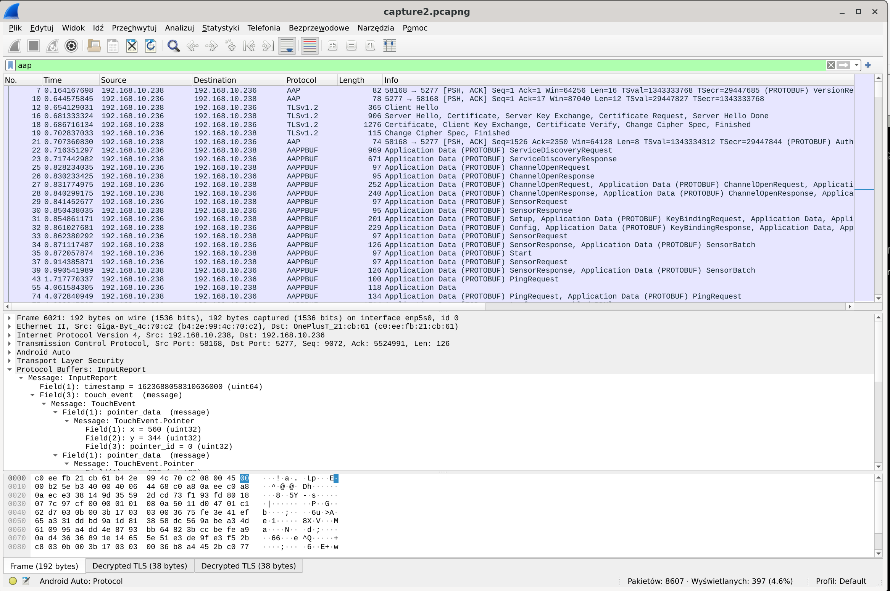

<!DOCTYPE html>
<html>
<head>
	<meta charset="UTF-8" />
    <title>Android Auto protocol research</title>
    <link rel="stylesheet" href="/style.css" />
    <meta name="viewport" content="width=device-width, initial-scale=1">
</head>
<body>
<h1>Android Auto protocol research</h1>

various bits and pieces describing Android Auto protocol (aka AAP) (aka GAL) and headunit emulator binary

<h2>integration guide</h2>

There’s headunit integration guide found in the abyss of google cache, which might provide high-level overview of AA features.
It is a bit outdated (version 1.3, while current version seem to be 1.6)

mirror there: <a href="huig13_cache.html">huig13_cache.html</a>

<h2>emulator binary hacking</h2>

Google provides desktop headunit emulators binaries for testing, described there:
<a href="https://developer.android.com/training/cars/testing">https://developer.android.com/training/cars/testing</a>.
In this descriptions I will refer to the Linux version. They provide x86_64 binaries, statically linked with OpenH264, PortAudio, OpenSSL.
I want to have AArch64 device working as headunit, so I have this slightly crazy idea that instead of reimplementing AAP protocol
use their binary under x86_64 user mode emulation, and move all heavy processing (video, audio and encryption) out of it through IPC to native side.
That their binary is statically linked causes a problem though, so first I need to patch their binary to make it import these symbols dynamically, so I can LD_PRELOAD
my own stubs instead of real library (and these will talk over IPC to native ARM side where real libraries will reside). This is done using <a href="https://github.com/lief-project/LIEF">LIEF</a>: <a href="destaticizer.py">destaticizer.py</a>.
Note that when replacing C++ functions you need to use llvm <a href="https://libcxx.llvm.org/">libc++</a> ABI, not the GNU libstdc++.

<h2>usb protocol</h2>

Their official emulator binary works only over TCP, not over USB as Android Auto is normally used. (their guide talks about using adb to bridge it, but proxy localhost:5277 with socket directly to phone and it will work over network too)
Protocol is the same however, and stream data is just pushed through bulk endpoints.
It just needs to be initialized through Android Open Accessory protocol, but that is <a href="https://source.android.com/devices/accessories/protocol">publicly documented</a>.

Here’s a simple program using libusb to proxy AAP over USB to Unix domain socket: <a href="apserver.c">apserver.c</a>. (and then you can use socat to connect it with emulator binary, or LD_PRELOAD some stub to redirect their TCP socket)

<h2>protobufs</h2>

AAP protocol uses protobufs to exchange most of structured data. Their description can be extracted from binary in human readable format (extracted using <a href="https://github.com/marin-m/pbtk">pbtk</a>):

<a href="common.proto">common.proto</a> and <a href="protos.proto">protos.proto</a>

<h2>wireshark dissector</h2>

I also made simple wireshark dissector for AAP: <a href="androidauto.lua">androidauto.lua</a>.

Almost all Android Auto communication is encrypted with TLS, so you need to dump session keys so Wireshark can dissect it (just point Wireshark to key logfile as usual).
You also need to configure Wireshark protobuf dissector to add paths to protobuf files linked in above section.
I think it should work fine for basic framing, sensor and input service, but it needs more work to extract ids from ServiceDiscoveryResponse to be more correct and work for other services.
To dump session keys from official headunit emulator, see emulator binary hacking section to export their internal SslWrapper, and then you can use this stub to use external OpenSSL and capture keys: <a href="ssl_preload.cpp">ssl_preload.cpp</a>

</body>
</html>
